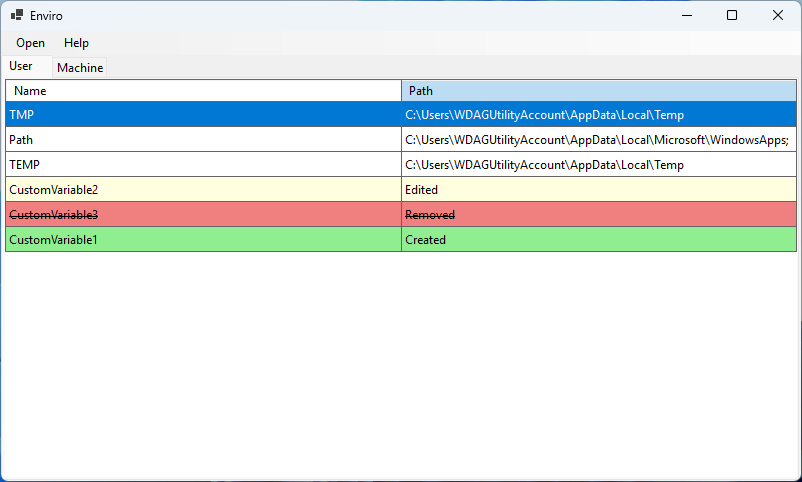

# Enviro

A lightweight environment variable manager for Windows with a classic interface.

## Why does this exist?

Windows has a built-in environment variable editor, but its interface is outdated and makes PATH management cumbersome. There's no change tracking to show what was modified, deleted, or created, and the design leaves much to be desired.

Enviro addresses these issues with a classic Windows interface and a change tracking system for safe environment variable management.

## Features

- 🎯 **Native WinForms**: Built with Windows Forms for a smaller binary size & performance.
- 📋 **Change Tracking**: See exactly what was modified, deleted, or created in your environment variables
- ⚡ **Instant Apply**: Changes take effect immediately without system restart

## Roadmap
- 🚧 **PATH Validation**: Automatic detection of invalid or missing directories in your PATH
- 🚧 **Import/Export System**: Backup and restore your environment variables

## Requirements

- Windows 7 or later
- .NET 8
- Administrator privileges (only for system variable modifications)

## Usage

1. Launch Enviro
2. Edit user variables, or provide admin credentials for system variables
3. Review changes before applying — the view will show all modifications
4. Apply changes

## Installation

### Windows

1. Download the latest release from the [Releases](https://github.com/regularentropy/enviro/releases) page
2. Extract the archive and run `Enviro.exe`
3. No additional dependencies required

For system-wide variable editing, run as administrator or allow elevation when prompted.

## Contributing
Pull requests are welcome. For major changes, open an issue first to discuss what you want to change.

Build requirements:
- Visual Studio 2022 or later
- .NET 8 SDK

## Used Assets
- Logo: https://www.svgrepo.com/svg/532995/pen-square

## License

[GPLv3](LICENSE) ©2025 regularentropy